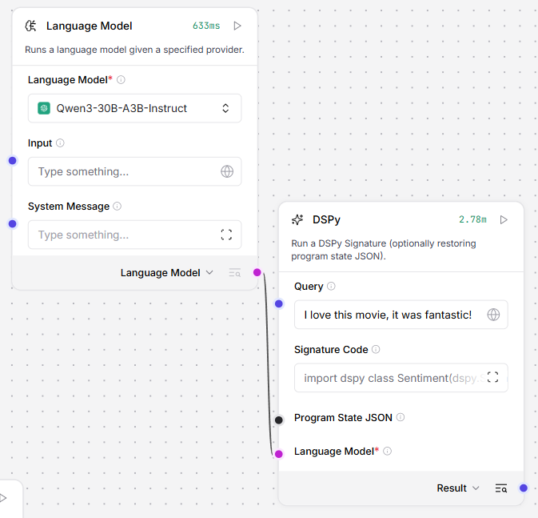
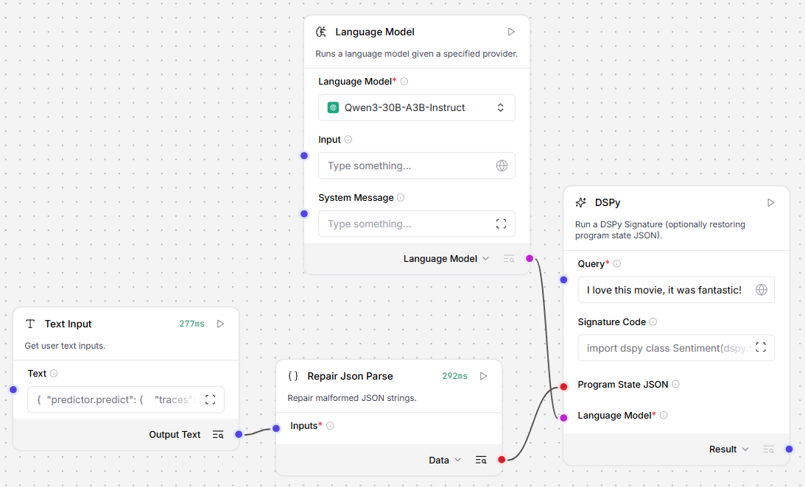

# LangFlow Lab Project

## Research: Langflow + DSPy Integration



**Output:**


**Load State:**



## Development

### VsCode Launch Configuration

```json
{
    "version": "0.2.0",
    "configurations": [
        {
            "name": "Run langflow",
            "type": "debugpy",
            "request": "launch",
            "program": "${workspaceFolder}/main.py",
            "console": "integratedTerminal",
            "args": [
                "run",
                "--components-path",
                "${workspaceFolder}/components",
                "--env-file",
                "${workspaceFolder}/.env"
            ],
            "envFile": "${workspaceFolder}/.env",
            "cwd": "${workspaceFolder}"
        }
    ]
}
```

### Environment Configuration

```env
LANGFLOW_HOST=0.0.0.0
LANGFLOW_PORT=17860
LANGFLOW_SUPERUSER=admin
LANGFLOW_SUPERUSER_PASSWORD=admin
LANGFLOW_AUTO_LOGIN=true
LANGFLOW_ENABLE_SUPERUSER_CLI=true
LANGFLOW_WORKERS=1
LANGFLOW_CONFIG_DIR=.langflow
LANGFLOW_SAVE_DB_IN_CONFIG_DIR=true
LANGFLOW_LANGCHAIN_CACHE=SQLiteCache
LANGFLOW_DATABASE_CONNECTION_RETRY=false
LANGFLOW_LOG_LEVEL=debug
LANGFLOW_DEV=true

LANGFLOW_FRONTEND_PATH=www
LANGFLOW_CORS_ORIGINS="http://localhost:17860"

LANGFLOW_REFRESH_SECURE=false
LANGFLOW_REFRESH_HTTPONLY=false
LANGFLOW_REFRESH_SAME_SITE=lax

DO_NOT_TRACK=true
```

### Frontend

```sh
git clone https://github.com/langflow-ai/langflow.git
cd langflow/src/frontend
npm install
npm run build
cp -r build/. /langflow_component_example/www/
```
